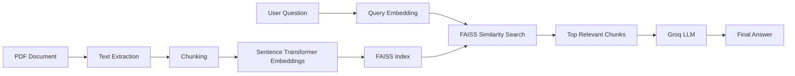

# 📚 PDF RAG using Databricks, FAISS & Groq

A beginner-friendly Retrieval-Augmented Generation (RAG) project that answers questions from a PDF using semantic search and an LLM. The solution extracts text from a PDF, creates embeddings, stores them in a FAISS vector database, retrieves relevant chunks for a user query, and generates context-aware answers using Groq. Built from pdf-rag-databricks.py

---

## Architecture

```text
                  PDF Document
                        |
                        v
                +---------------+
                | Extract Text  |
                +---------------+
                        |
                        v
                +---------------+
                | Chunk Text    |
                +---------------+
                        |
                        v
                +---------------+
                | Embeddings    |
                | MiniLM-L6-v2  |
                +---------------+
                        |
                        v
                +---------------+
                | FAISS Index   |
                +---------------+
                        |
            Save Index & Chunks
          (Databricks Volumes)

================================================



---

## Tech Stack

- Databricks
- Python
- PyPDF
- Sentence Transformers (`all-MiniLM-L6-v2`)
- FAISS
- Groq API

---

## Workflow

1. Read PDF and extract text.
2. Split text into overlapping chunks.
3. Generate embeddings using Sentence Transformers.
4. Store embeddings in a FAISS vector index.
5. Save FAISS index and chunks in Databricks Volumes.
6. Convert user query into an embedding.
7. Retrieve top-k relevant chunks using FAISS similarity search.
8. Build context from retrieved chunks.
9. Send context and question to Groq LLM.
10. Generate an answer grounded only on the PDF content.

---

## Project Structure

```text
Project
│
├── pdf-rag-databricks.py
│
└── Databricks Volume
    (/Volumes/retail_project/default/rag_docs/)
    ├── AI-research-paper.pdf
    ├── pdf_index.faiss
    └── chunks.pkl
```

---

## Installation

```python
%pip install pypdf sentence-transformers faiss-cpu groq

dbutils.library.restartPython()
```

---

## Example

### Question

```text
What are applications of AI?
```

### Flow

```text
Question
   ↓
Query Embedding
   ↓
FAISS Retrieval
   ↓
Relevant Chunks
   ↓
Groq LLM
   ↓
Answer
```

### Output

```text
AI applications include healthcare, finance, recommendation systems,
autonomous vehicles, and natural language processing.
```

---

## Key Learning

This project implements the complete RAG pipeline:

```text
PDF → Chunking → Embeddings → FAISS → Retrieval → Context → LLM → Answer
```

It demonstrates how vector search helps retrieve relevant information from documents and provides context to an LLM, enabling accurate PDF-based question answering.

---

## Repository

**Repository Name:** `end-to-end-rag-pipeline`

**Description:**

```text
End-to-end RAG pipeline for PDF question answering using Databricks, FAISS, Sentence Transformers, and Groq
```

